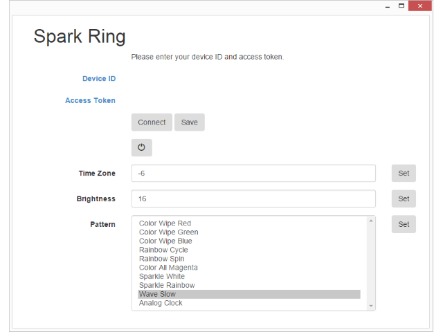

SparkRing
=========

Control a [Adafruit NeoPixel Ring] with a [Spark Core] via a web browser or smartphone app.

[Demo Video](http://www.youtube.com/watch?v=caFzIyTgmRw):

Hardware
--------
Requires:

[Spark Core]

Either of the following:

[Adafruit NeoPixel Ring]

[Adafruit Spark NeoPixel Ring Kit] *not currently available*:

Features
--------
* Turn the NeoPixel Ring on and off
* Adjust the time zone
* Adjust the brightness
* Change the display pattern

Patterns are requested by the app from the Spark Core, so as new patterns are added, they're automatically listed in the app.

[Spark Core]:https://www.adafruit.com/product/2127
[Adafruit NeoPixel Ring]:https://www.adafruit.com/product/1586
[Adafruit Spark NeoPixel Ring Kit]:https://www.adafruit.com/products/2268
[spark-ring-app-1]:spark-ring-app-1.png
[spark-ring-1]:spark-ring-1.png
